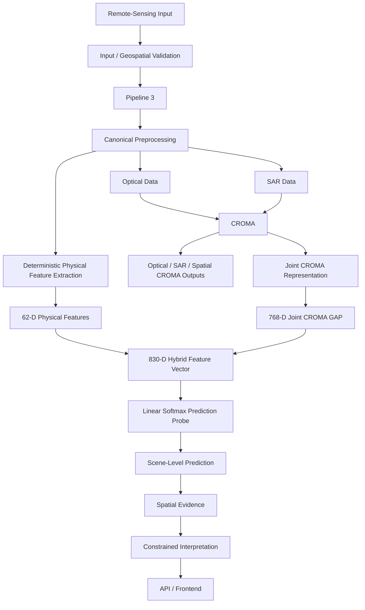
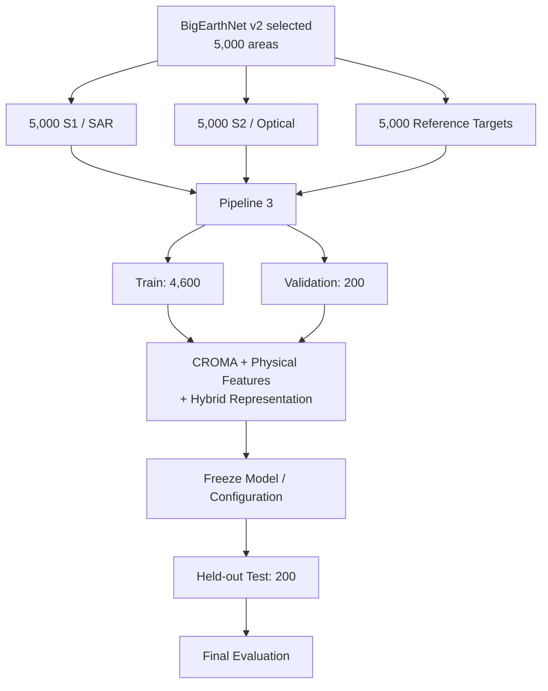
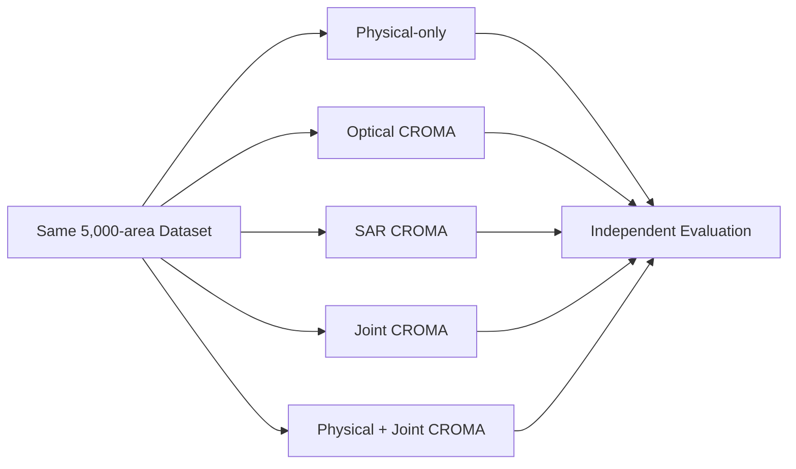
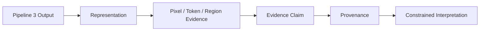
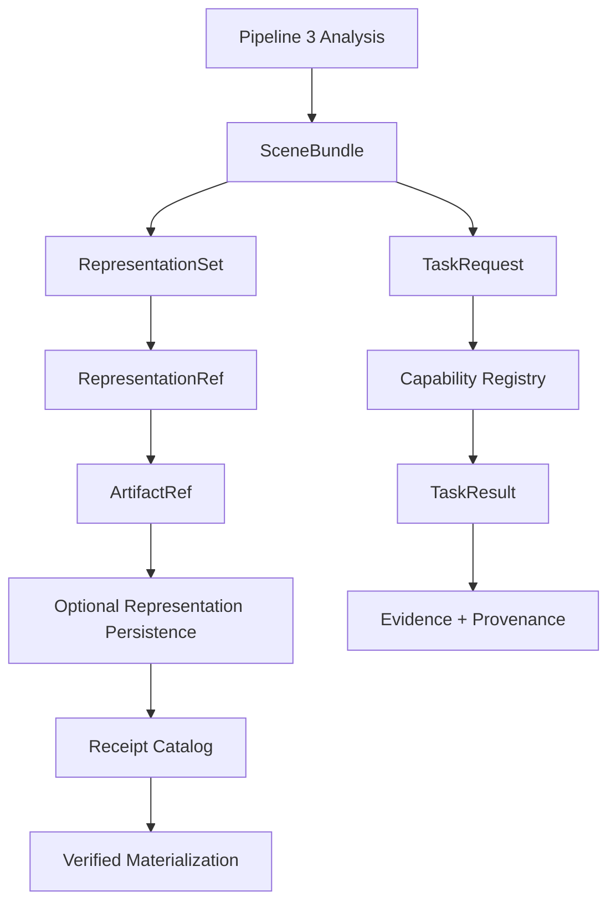
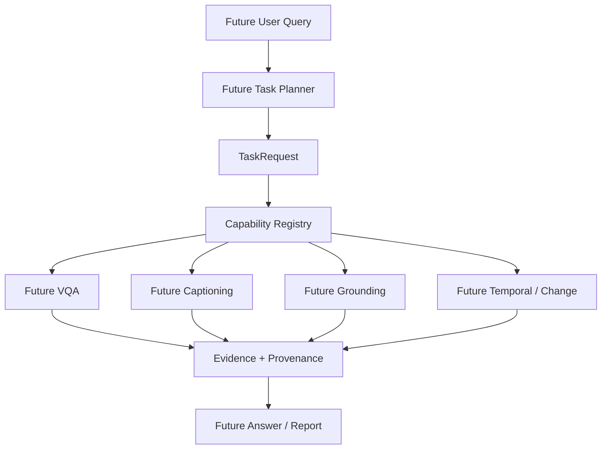

# SatQuery AI

SatQuery AI is an evidence-first remote-sensing research and application system for validated Sentinel-1/Sentinel-2 data. Its canonical production and scientific architecture is **Pipeline 3**. Pipeline 3 combines deterministic physical features with representations from one pretrained remote-sensing model, CROMA, and carries the resulting scene analysis through spatial evidence, constrained interpretation, the API, and the frontend.

## Current status

**CURRENT PIPELINE 3 — IMPLEMENTED SCIENTIFIC RUNTIME.** The exact BigEarthNet v2 selected 5,000-area multimodal experiment is complete and validated. The held-out 200-area test result is **4.1034 pp MAE**, **9.5873 pp RMSE**, and **65.0% dominant-class accuracy**.

The supported application entry point is `python -m src.api`; HTTP analysis dispatches to `src.analysis_engine.run_analysis`. The runtime executes deterministic scene analysis, representation extraction, evidence generation, and constrained interpretation. The evaluated scene-level predictor is preserved as a controlled scientific artifact. VQA, captioning, learned grounding, temporal/change prediction, calibrated confidence, and a full agentic planner are not implemented.

See [Current Project Status](docs/CURRENT_PROJECT_STATUS.md) for the release-level inventory and [Pipeline 3 Exact 5,000-Area Training Report](docs/PIPELINE3_5000_TRAINING_REPORT.md) for the full scientific record.

## Canonical Pipeline 3

- **Pipeline 1: ARCHIVED** — historical So2Sat FusionCNN experiment.
- **Pipeline 2: ARCHIVED** — historical GEE-only experiment.
- **Pipeline 3: CANONICAL** — current GEE + CROMA production/scientific architecture.

The archived runners remain for reproducibility and do not compete with Pipeline 3 as production choices.

### Current runtime



The GEE integration supplies geospatial context, authentication/status, and provider-backed availability/search where configured. `/api/analyze` processes uploaded rasters or configured local samples; it does not implicitly download provider rasters.

## Scientific representation and predictor

CROMA is **one primary pretrained representation model**. Optical, SAR, joint, pooled/GAP, and spatial-token representations are outputs of that one model, not separate predictive models.

The evaluated scientific representation is:

```text
Optical data ──┐
               ├──> CROMA ──> 768-D joint CROMA GAP
SAR data ──────┘

Validated imagery ──> deterministic extraction ──> 62-D physical features

62-D physical + 768-D joint CROMA ──> 830-D hybrid feature vector
                                     ──> linear softmax prediction probe
                                     ──> scene-level prediction
```

“Hybrid” means the combination of representation sources. It does not denote a separate third model. The runtime `HybridFusion` 192-D representation contains seeded, untrained projection components and is representation infrastructure, not the final trained predictor.

## Exact 5,000-area dataset

The current core dataset is the **BigEarthNet v2 selected 5,000-area verified multimodal dataset**. All **5,000/5,000** areas have Sentinel-1/SAR, Sentinel-2/optical, reference targets, and metadata.



The 4,600 training and 200 validation areas were used for model development and selection. The 200 test areas remained held out until the final frozen evaluation.

## Final 5,000-area results

These are controlled representation/predictor variants evaluated separately. They are not five models running simultaneously.



| Configuration | Test MAE (pp) | Test RMSE (pp) | Accuracy |
|---|---:|---:|---:|
| Constant | 7.6803 | 15.0932 | 22.0% |
| Physical | 6.3836 | 12.9160 | 39.0% |
| Optical CROMA | 4.7686 | 10.7049 | 60.5% |
| SAR CROMA | 5.1967 | 11.5806 | 51.0% |
| Joint CROMA | 4.2690 | 9.8306 | 62.5% |
| Physical + Joint CROMA (Hybrid) | **4.1034** | **9.5873** | **65.0%** |

Hybrid refers to the combination of the 62-D physical feature vector and the 768-D joint CROMA representation. It does not denote a separate third model.

### Historical 1,000-area comparison

The earlier 1,000-area result is historical, not the current baseline.

| Metric | Historical 1,000-area result | Current 5,000-area result | Improvement |
|---|---:|---:|---:|
| MAE | 4.8846 pp | 4.1034 pp | −0.7812 pp |
| RMSE | 11.0251 pp | 9.5873 pp | −1.4378 pp |
| Accuracy | 59.5% | 65.0% | +5.5 percentage points |

## Evidence and provenance



The current system supplies deterministic evidence, spatial evidence, provenance, and constrained interpretation. It does not supply learned grounding, arbitrary VQA evidence generation, calibrated confidence, or production temporal prediction.

## Architecture foundation

The following are implemented architecture infrastructure components, **not additional AI models**.



The foundation includes `SceneBundle`, `RepresentationSet`, `TaskRequest`, `TaskResult`, `Capability`, `CapabilityRegistry`, `RepresentationRef`, `ArtifactRef`, `SpatialReference`, optional live representation persistence, and a trusted local receipt catalog.

## Current capabilities

- Pipeline 3 deterministic scene analysis through `src.analysis_engine.run_analysis`.
- Strict raster, identity, modality, CRS, transform, extent, finite-value, grid, AOI, and date validation.
- Deterministic 62-D physical feature extraction.
- Official CROMA optical, SAR, joint, pooled, and spatial-token representations.
- Current physical + joint-CROMA hybrid scene-level prediction in the validated scientific workflow.
- Deterministic pixel, local-window, block, token-grid, and connected-region evidence.
- Evidence-constrained interpretation and provenance.
- Typed architecture contracts and representation/artifact references.
- Optional synchronous/local representation persistence with checksum verification.
- Trusted local receipt catalog and verified materialization.
- Loopback HTTP API, immutable JSON reports, and browser frontend.

## Future research roadmap

**PLANNED / FUTURE — NOT CURRENTLY IMPLEMENTED**



VQA, captioning, learned grounding, temporal/change prediction, change VQA, calibrated confidence, and a full agentic planner remain future research.

## Dataset roles

### Current core dataset

The BigEarthNet v2 selected 5,000-area multimodal dataset supplies 5,000 S1/SAR inputs, 5,000 S2/optical inputs, and 5,000 reference targets for Pipeline 3 training and evaluation.

### Future task datasets

These resources are not claimed as currently integrated:

- `BigEarthNet.txt` — future remote-sensing language/adaptation resource.
- RSVQA — future single-image VQA evaluation.
- VRSBench — future captioning/grounding-related evaluation where applicable.
- CDVQA — future bi-temporal/change VQA evaluation.
- ISRO/SAC hidden dataset — future private/generalization evaluation.

Raw datasets, imagery, archives, checkpoints, and local feature stores remain outside Git.

## Reproducibility

- Dataset fingerprint: `7dfd5cd5077e7fd0307acd3fb442d4745aa829a03611c7522e08acbc7f027625`
- Split fingerprint: `2232ac5bc65d3ed20c6f39deb6037bb8e0543100b247fd6c9e538eddf9feb86c`
- Scientific fingerprint: `ac8bbefc8918b2ee16f47653e6fd91eba0d875e4ce340e27254248712a173fae`

These identifiers define the exact current 5,000-area scientific checkpoint. Machine-readable manifests, final metrics, ablations, predictions, and the one-time test receipt are under `experiments/pipeline3_5000/`.

## Limitations

- Class support is strongly imbalanced, especially for rare classes.
- Coastal wetlands had zero positive examples in the held-out test set.
- The current predictive system is scene-level; spatial evidence is deterministic rather than learned grounding.
- VQA, learned grounding, production temporal prediction, and calibrated confidence are unavailable.
- The receipt catalog is local, and representation persistence is synchronous/local.
- Hidden ISRO/SAC evaluation remains future work.

## API and local usage

Create an environment, install dependencies, and configure machine-local paths:

```powershell
python -m venv .venv
.\.venv\Scripts\Activate.ps1
python -m pip install -r requirements.txt -r requirements-dev.txt
Copy-Item .env.example .env
```

Start the application:

```powershell
python -m src.api --host 127.0.0.1 --port 8000
```

Important routes are `GET /api/health`, `GET /api/sources`, `POST /api/availability/search`, `POST /api/upload`, `POST /api/analyze`, and `GET /api/report/{id}`.

Run the release checks:

```powershell
python -m pytest -q
node --test tests/frontend_state.test.cjs
python -m compileall -q src tests scripts
node --check src/static/app.js
git diff --check
```

## Repository structure

```text
src/                         canonical runtime, contracts, evidence, API, frontend
tests/                       Python and frontend regression tests
docs/                        current status, architecture, audits, scientific reports
experiments/pipeline3_5000/  versioned manifests and compact scientific artifacts
experiments/pipelines/       archived numbered research runners
artifacts/                   small canonical evidence/interpretation artifacts
data/contracts/              dataset contracts; no raw imagery
scripts/                     acquisition, audit, validation, and reproduction tools
```

## Detailed documentation

- [Current Project Status](docs/CURRENT_PROJECT_STATUS.md)
- [Pipeline 3 5,000-Area Training Report](docs/PIPELINE3_5000_TRAINING_REPORT.md)
- [Pipeline 3 5,000-Area Re-validation](docs/PIPELINE3_5000_REVALIDATION.md)
- [Canonical Runtime Map](docs/CANONICAL_RUNTIME_MAP.md)
- [Architecture Contracts](docs/ARCHITECTURE_CONTRACTS.md)
- [Deterministic Scene Analysis Capability](docs/DETERMINISTIC_SCENE_ANALYSIS_CAPABILITY.md)
- [Representation and Artifact Architecture](docs/REPRESENTATION_ARTIFACT_ARCHITECTURE.md)
- [Live Representation Persistence](docs/LIVE_REPRESENTATION_PERSISTENCE.md)
- [Receipt Catalog Architecture](docs/RECEIPT_CATALOG_ARCHITECTURE.md)
- [Capability Roadmap](docs/CAPABILITY_ROADMAP.md)
- [Pipeline Consolidation](docs/PIPELINE_CONSOLIDATION.md)
- [Architecture Audit](docs/ARCHITECTURE_AUDIT.md)
- [Architecture Freeze](docs/ARCHITECTURE_FREEZE.md)

## Next research phase

The validated Pipeline 3 checkpoint and architecture foundation are ready to support a separately scoped next research phase. Any future task capability must preserve the frozen dataset identities, scientific artifacts, runtime contracts, and explicit evidence/provenance boundaries documented here.
