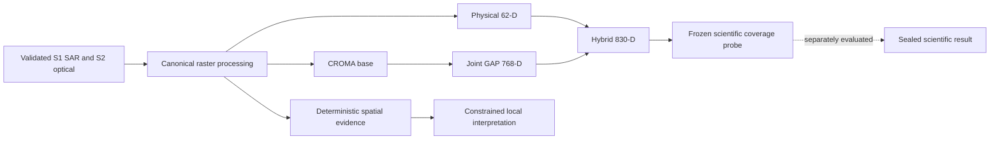

# SatQuery AI

SatQuery AI is a remote-sensing research and local application project built around validated Sentinel-1 SAR and Sentinel-2 optical data. **Pipeline 3** is canonical: deterministic physical scene features, one pretrained CROMA representation model, typed evidence and provenance, and a separately evaluated scene-level coverage predictor. The local API provides deterministic analysis and constrained interpretation; the frozen scientific predictor is a research artifact, not a claim that every API request runs it.

## Current status

The exact BigEarthNet v2 **5,000-area multimodal scientific baseline is complete**. The architecture foundation through Phase 2H is complete: image-language contracts, the fail-closed spatial audit, Ravi engineering integration, and representation/compute/storage policy are documented. A concrete Earth observation vision-language model (VLM) has **not** been selected or implemented.

### Foundation Status

| Phase | Status |
| --- | --- |
| 2E — Image-language foundation | **COMPLETE** |
| 2F — Spatial semantics audit | **COMPLETE / FAIL-CLOSED** |
| 2G — Ravi engineering integration | **COMPLETE** |
| 2H — Representation/compute/storage policy | **COMPLETE** |

| Foundation work | Current status | Result |
| --- | --- | --- |
| Phase 1 — deep architectural audit | **COMPLETED — DOCUMENTED** | Mapped the live API, typed scientific path, archived pipelines, and integration boundary without changing scientific behavior. |
| Phase 2A — BigEarthNet.txt annotation foundation | **COMPLETED — VALIDATED** | Source-preserving canonical records, quarantine, split and conflict checks. |
| Phase 2B — spatial contracts and leakage policy | **COMPLETED — IMPLEMENTED** | Typed coordinate spaces, validated raster transforms, token correspondence, and image-group split rules. |
| Phase 2C — representation linking | **COMPLETED — IMPLEMENTED** | Deterministic annotation-to-representation links with availability and provenance; no learned grounding. |
| Phase 2D.1 — representation catalog / region contract | **COMPLETED — IMPLEMENTED** | Verified artifact admission, catalog statuses, and typed region evidence. |
| Phase 2D.2 — verified 5,000-area representation core | **COMPLETED — VERIFIED** | Three core vectors per area, 15,000 typed receipts, 157 shard groups, validated catalog; existing CROMA cache reused without retraining. |
| Phase 2E — image-language foundation | **COMPLETED — READY** | Model-independent samples, task/input/output contracts, adapter hooks, and validated BigEarthNet.txt view; no VLM inference. |
| Phase 2F — BigEarthNet spatial semantics | **COMPLETED — UNRESOLVED / FAIL-CLOSED** | Source geometry preserved; unknown coordinate convention blocks unsafe mapping. |
| Phase 2G — Ravi engineering integration | **COMPLETED** | Useful bounded export, selective acquisition, and reproducibility patterns integrated without duplicating the scientific pipeline. |
| Phase 2H — representation/compute/storage policy | **COMPLETED** | Scientific and future VLM representation boundaries, storage, compute, cache, and provenance policy documented. |

Pipeline 1 (So2Sat FusionCNN) and Pipeline 2 (GEE-only) are archived research paths; Pipeline 3 is canonical. See [Current Project Status](docs/CURRENT_PROJECT_STATUS.md), the [architecture audit](docs/ARCHITECTURE_AUDIT.md), and the [Pipeline 3 training report](docs/PIPELINE3_5000_TRAINING_REPORT.md).

The foundation boundary is:

```text
RAW DATA
    -> REPRESENTATION CONTRACTS
    -> SCIENTIFIC REPRESENTATIONS
    -> TASK/MODEL-SPECIFIC ADAPTERS
    -> FUTURE VLM / TASK CAPABILITIES
```

Scientific predictor representations and future VLM representations are
intentionally separate.

## Canonical Pipeline 3

Pipeline 3 combines validated optical/SAR rasters, deterministic 62-dimensional physical features, and the frozen CROMA base model. Its evaluated scientific path concatenates `physical_62d` with `joint_croma_gap_768d` in that order to form `hybrid_830d` for the coverage probe. The live application uses its own deterministic analysis and evidence path; the evaluated probe is not silently substituted for an API prediction service.

## Current capabilities

The local application enters through `python -m src.api` and dispatches analysis to `src.analysis_engine.run_analysis`. It validates inputs and rasters, extracts deterministic physical features and available CROMA representations, creates spatial evidence, and returns constrained interpretation and provenance through a loopback HTTP API and browser frontend. Provider-backed geospatial availability/search depends on configuration; `/api/analyze` does not implicitly download provider rasters.

The scientific workflow has a frozen physical-plus-CROMA **830-dimensional hybrid** vector and a separately evaluated linear softmax coverage probe. CROMA is one pretrained model with optical, SAR, joint, GAP, and spatial-token outputs; those outputs are not separate models. The live `HybridFusion` 192-dimensional representation differs from the evaluated `hybrid_830d` predictor input. Architecture contracts, optional local persistence, receipts, a representation catalog, image-language adapter interfaces, and selective/resumable acquisition are implemented foundations, not a VQA or captioning runtime.



## Scientific baseline and dataset

The verified BigEarthNet v2 selected dataset has **5,000 Sentinel-1/SAR inputs, 5,000 Sentinel-2/optical inputs, and 5,000 reference maps**, with **4,600 train, 200 validation, and 200 held-out test areas**. Area identities and splits are frozen. The final hybrid result on the sealed test set is:

| Metric | Frozen result |
| --- | ---: |
| Mean absolute error | **4.1034286465 percentage points** |
| Root mean squared error | **9.5873311030 percentage points** |
| Dominant-class accuracy | **65.0%** |

- Scientific fingerprint: `ac8bbefc8918b2ee16f47653e6fd91eba0d875e4ce340e27254248712a173fae`
- Dataset fingerprint: `7dfd5cd5077e7fd0307acd3fb442d4745aa829a03611c7522e08acbc7f027625`
- Split fingerprint: `2232ac5bc65d3ed20c6f39deb6037bb8e0543100b247fd6c9e538eddf9feb86c`

These metrics belong to the exact 19-class scene-level coverage experiment, not VQA, captioning, grounding, or temporal prediction. The [final scientific artifacts](experiments/pipeline3_5000/final/fingerprint.json) and [training report](docs/PIPELINE3_5000_TRAINING_REPORT.md) preserve model selection, predictions, metrics, and reproducibility details. Raw imagery and checkpoints remain outside Git.

## Foundation phases

**Phase 1** was a forensic architecture audit. It distinguished the live deterministic API from the typed scientific experiment path, documented canonical runtime and archived runners, and set additive task/representation boundaries. See the [architecture audit](docs/ARCHITECTURE_AUDIT.md) and [canonical runtime map](docs/CANONICAL_RUNTIME_MAP.md).

**Phase 2A** established a pinned, source-preserving BigEarthNet.txt annotation schema and conservative validation/quarantine. **Phase 2B** added spatial and leakage contracts. **Phase 2C** linked annotations to canonical image identities, split, source geometry, representation availability, and provenance. Links describe geometric correspondence and verified references; they do not assert learned grounding. See the [annotation audit](docs/PHASE2A_ANNOTATION_AUDIT.md), [spatial contract](docs/PHASE2B_SPATIAL_CONTRACT.md), [leakage policy](docs/PHASE2B_LEAKAGE_POLICY.md), and [linking report](docs/PHASE2C_REPRESENTATION_LINKING.md).

**Phase 2D.1** introduced verified receipt/shard admission to the representation catalog and a typed region contract. **Phase 2D.2** located and validated the authoritative historical 5,000-area CROMA cache, reused physical and joint GAP arrays, and materialized only the exact hybrid concatenation needed by the frozen predictor. No scientific retraining occurred. See the [catalog report](docs/PHASE2D_REPRESENTATION_CATALOG.md), [region contract](docs/PHASE2D_FOUNDATION_AUDIT.md), and [materialization report](docs/PHASE2D2_REPRESENTATION_MATERIALIZATION.md).

**Phase 2E** joined validated annotations to the verified representation core as model-independent `ImageLanguageSample` records. It defined task, modality, input, prompt, output, and VLM adapter contracts. Generation/scoring are unsupported by default. RSVQA, VRSBench, and CDVQA are future adapter hooks, not completed evaluations. See the [image-language foundation](docs/PHASE2E_IMAGE_LANGUAGE_FOUNDATION.md).

## Annotation and image-language foundation

The pinned BigEarthNet.txt source was scanned without downloading it into Git or silently rewriting source text/geometry. The [Phase 2A audit](docs/PHASE2A_ANNOTATION_AUDIT.md) records:

| Annotation audit measure | Count |
| --- | ---: |
| Source rows scanned | 9,553,962 |
| Selected canonical records | 101,571 |
| Validated samples | 101,542 |
| Quarantined records | 29 |
| Duplicate annotation IDs / exact duplicates / conflicting source IDs | 0 / 0 / 0 |
| Image-level conflicts / spatial conflicts | 0 / 0 |
| Cross-split image leakage / test rows assigned to train | 0 / 0 |
| Identical QA-content overlaps across image splits | 2,001 |

The **2,001** figure is content overlap, **not** image identity leakage. Quarantined records remain excluded from the validated view. Source partitions do not override canonical image splits.

The [Phase 2E view](docs/PHASE2E_IMAGE_LANGUAGE_FOUNDATION.md) has **101,542 validated samples on 4,770 unique images**: 93,208 train, 4,175 validation, and 4,159 test. All have the verified required core representations; **0** are missing them. These are assembled annotation/input records, not evaluated VLM answers.

| Implemented source task mapping | Reserved temporal task types |
| --- | --- |
| `VQA_BINARY`, `VQA_MULTIPLE_CHOICE`, `CAPTIONING`, `GROUNDING_TEXT_BOX`, `GROUNDING_POINT` | `TEMPORAL_VQA`, `CHANGE_DESCRIPTION`, `CHANGE_GROUNDING` |

Task names identify typed data and future adapter capabilities. They do not imply runtime VQA, caption generation, or learned grounding.

## Spatial contracts and the BigEarthNet.txt boundary

SatQuery's **own verified raster contract** defines `PIXEL`, `ANALYSIS_GRID`, `CROMA_TOKEN`, `NORMALIZED_IMAGE`, and `GEO` coordinate spaces. Its common analysis grid is **120×120** pixels; CROMA has **15×15 = 225** row-major spatial tokens, each geometrically associated with an **8×8 analysis-pixel block**. `GEO` transforms require a validated CRS and affine transform. Explicit validation and typed conversions prevent silent row/column or coordinate-space changes. See the [spatial contract](docs/PHASE2B_SPATIAL_CONTRACT.md).

**Phase 2F: COMPLETED — UNRESOLVED / FAIL-CLOSED.** BigEarthNet.txt spatial annotations are preserved, but authoritative coordinate semantics required for safe mapping into the internal 120×120 analysis grid and 15×15 CROMA token grid have not been established. No derived BigEarthNet analysis-grid or token mapping is claimed. This intentional safeguard does not mean the dataset or project failed. See the [Phase 2F spatial-semantics audit](docs/PHASE2F_BIGEARTHNET_SPATIAL_SEMANTICS.md).

**A representation originating from an image is not automatically learned grounding.** Spatial features, geometric links, and source boxes are distinct from evaluated phrase-to-region predictions.

## Representation architecture

The verified **5,000-area core** contains 5,000 `physical_62d`, 5,000 `joint_croma_gap_768d`, and 5,000 `hybrid_830d` vectors. Its **15,000 typed receipts** cover three representations per image. There are **157 source shards and 157 corresponding persisted hybrid shards**, with 32 areas per full shard and eight in the final shard. The **75,000-row representation catalog** marks 15,000 core rows `VERIFIED` and 60,000 optional rows `MISSING`; a catalog row does not create an artifact. The existing CROMA cache was reused, and neither CROMA inference nor scientific retraining was rerun for Phase 2D.2.

| Representation | Current role | Generation/persistence decision |
| --- | --- | --- |
| `physical_62d` | Frozen scientific component; optional physical scene context | Already persisted in verified source shards. |
| `joint_croma_gap_768d` | Frozen fused scene-level context | Already persisted; a future adapter must establish compatibility. |
| `hybrid_830d` | Frozen scientific predictor input | Scientific predictor only; not a universal VLM input. |
| Raw optical/SAR | Pixel inputs when a selected task/adapter requires them | On-demand from source imagery. |
| CROMA spatial tokens | 225×768 features for a justified spatial consumer | On-demand; no full 5,000-area token cache. |
| Temporal representations | Future paired observations/change inputs | Deferred until T1/T2 identities and spatial alignment are verified. |
| Region embeddings | Future region-level model inputs | Deferred; no learned grounding or source geometry mapping. |
| Metadata embeddings | Future model-specific context | Deferred until a concrete consumer exists. |
| Learned optical-SAR fusion | Future task/model-specific fusion | Deferred; not part of the scientific `hybrid_830d` contract. |

The [Phase 2H representation, compute, and storage policy](docs/PHASE2H_REPRESENTATION_COMPUTE_STORAGE_POLICY.md) and [materialization report](docs/PHASE2D2_REPRESENTATION_MATERIALIZATION.md) describe the distinctions and validation rules. Optional `MISSING` families are not fabricated to fill the catalog.

## Evidence, provenance, and engineering review

Source annotation IDs and hashes, canonical image/split identity, typed representation references, shard and per-sample SHA-256 checksums, producer/checkpoint/preprocessing metadata, and scientific fingerprints form the verification chain. The receipt loader verifies artifacts and samples; the catalog reports availability without inferring it from filenames. Deterministic pixel/token/region evidence and constrained interpretation are not learned VLM evidence.

### Reproducibility boundary

The frozen dataset, split, and scientific fingerprints above identify the evaluated population and result. The verified representation core has 15,000 typed receipts and catalog fingerprint `0f5ce8feceff2fe8f2a75e1570b36edabf8a4716c57159243ffc6063eafcfd30`; its receipt-catalog SHA-256 is `3deb01c15ecfa76f99098d54333bff0d0ce831b0d3af536d6b85cf9aea3deece`. Historical predictions, configuration, checkpoint identity, and the one-time test receipt are documented in the [scientific report](docs/PIPELINE3_5000_TRAINING_REPORT.md) and [materialization report](docs/PHASE2D2_REPRESENTATION_MATERIALIZATION.md). These identifiers do not imply fresh inference or retraining.

**Phase 2G: COMPLETED.** The [Ravi engineering audit](docs/PHASE2G_RAVI_ENGINEERING_INTEGRATION.md) inspected bounded/batched CROMA export, selective/resumable acquisition, and evaluation/reproducibility patterns. Useful missing patterns were integrated without copying Ravi-specific notebooks or LMDB paths into production. Existing CROMA materialization and receipt/catalog infrastructure remains authoritative.

## Performance and storage foundation

**Phase 2H: COMPLETED.** Measured local values from the policy audit are: representation artifacts **34,296,453 bytes**, representation catalog **55,915,684 bytes**, representation links **277,860,220 bytes**, and BigEarthNet.txt source artifacts **466,875,206 bytes**. A complete 5,000-area spatial CROMA token family is **calculated** at about **3.22 GiB** raw float32 payload; optical + SAR + joint token grids are **calculated** at about **9.66 GiB**. These token values are calculated, not measured stored sizes. Local raw 5,000-area imagery was not available for measurement.

The target machine is an **RTX 5060 with 8 GB VRAM and 24 GB RAM**. Historical physical+CROMA extraction reported 904,975,360 bytes peak PyTorch GPU allocation; it was not a model-only measurement or a VLM fit test. The [performance/storage audit](docs/PHASE3_PERFORMANCE_STORAGE_AUDIT.md) separates measured storage and memory from estimates.

- **Storage:** preserve verified source data, frozen core vectors, checkpoints, receipts, manifests, and reproducibility evidence. Avoid duplicate normalized imagery and speculative embeddings.
- **Lazy generation:** load raw optical/SAR only for an adapter that needs pixels; generate only the required CROMA token family for a justified spatial task; defer temporal tensors pending verified paired identity/alignment.
- **Cache reuse:** match dataset/source identity, hashes, image/split, preprocessing, representation version, modality, shape/dtype, and checkpoint when applicable. An ID match alone is insufficient.
- **Future VLM gate:** before deployment, declare input/model requirements and measure cold/warm load, peak VRAM and RAM, batch/sequence behavior, latency, and any quantization/offload on the target machine. No future VLM is claimed to fit yet.

## Current limitations

The following are **FUTURE / NOT IMPLEMENTED**: a concrete EO VLM; single-image VQA runtime or RSVQA evaluation; captioning runtime or VRSBench evaluation; learned grounding; temporal representation learning or CDVQA evaluation; calibrated task-specific confidence; a full agentic controller; a production temporal/change pipeline; hidden ISRO/SAC evaluation; and automatic BigEarthNet.txt geometry-to-token mapping. Current scientific performance is scene-level and class support is imbalanced, especially for rare classes. See the [training report](docs/PIPELINE3_5000_TRAINING_REPORT.md) for evaluation limits.

## Future research roadmap

Foundation through Phase 2H is **COMPLETE**.

Next: **Phase 3 — EO-VLM landscape audit and model/adapter selection**.

Later: benchmark integration, VQA, captioning, grounding, optical-SAR
multimodal analysis, temporal/change analysis, agentic controller work, and
ISRO/SAC hidden evaluation. This README does **not** select EarthDial or any
other model.

## API and local usage

With a configured local environment and machine-local dataset/CROMA paths, install dependencies and start the loopback API:

```powershell
python -m venv .venv
.\.venv\Scripts\Activate.ps1
python -m pip install -r requirements.txt -r requirements-dev.txt
Copy-Item .env.example .env
python -m src.api --host 127.0.0.1 --port 8000
```

Important routes are `GET /api/health`, `GET /api/sources`, `POST /api/availability/search`, `POST /api/upload`, `POST /api/analyze`, and `GET /api/report/{id}`. See the [runtime map](docs/CANONICAL_RUNTIME_MAP.md) for path ownership and configuration. Run the Python regression suite with `python -m pytest -q`; the completed foundation verification recorded **359 passed, 5 skipped, 0 failed** and `git diff --check` passed. Local worktrees with an inaccessible default pytest temp directory may need an explicit writable `--basetemp`.

## Repository structure

```text
src/                         Local API, runtime, contracts, representations, evidence
tests/                       Python and frontend regression tests
docs/                        Audits, phase reports, contracts, scientific reports
experiments/pipeline3_5000/  Frozen manifests and compact scientific results
experiments/pipelines/       Archived research runners
artifacts/                   Local receipts, catalogs, and verification artifacts
data/contracts/              Dataset contracts; raw imagery remains outside Git
scripts/                     Acquisition, validation, materialization, audits
```

## Documentation

- [Current Project Status](docs/CURRENT_PROJECT_STATUS.md) and [Pipeline 3 Training Report](docs/PIPELINE3_5000_TRAINING_REPORT.md)
- [Phase 2A Annotation Audit](docs/PHASE2A_ANNOTATION_AUDIT.md), [Phase 2B Spatial Contract](docs/PHASE2B_SPATIAL_CONTRACT.md), [Phase 2B Leakage Policy](docs/PHASE2B_LEAKAGE_POLICY.md), [Phase 2C Representation Linking](docs/PHASE2C_REPRESENTATION_LINKING.md)
- [Phase 2D Representation Catalog](docs/PHASE2D_REPRESENTATION_CATALOG.md), [Phase 2D.2 Materialization](docs/PHASE2D2_REPRESENTATION_MATERIALIZATION.md), [Phase 2E Image-Language Foundation](docs/PHASE2E_IMAGE_LANGUAGE_FOUNDATION.md)
- [Phase 2F BigEarthNet Spatial Semantics](docs/PHASE2F_BIGEARTHNET_SPATIAL_SEMANTICS.md), [Phase 2G Ravi Engineering Integration](docs/PHASE2G_RAVI_ENGINEERING_INTEGRATION.md), [Phase 2H Representation/Compute/Storage Policy](docs/PHASE2H_REPRESENTATION_COMPUTE_STORAGE_POLICY.md)
- [Representation Strategy](docs/PHASE3_REPRESENTATION_AUDIT.md), [Performance and Storage Audit](docs/PHASE3_PERFORMANCE_STORAGE_AUDIT.md)

## Next research phase

Phase 3 — EO-VLM landscape audit and model/adapter selection.
