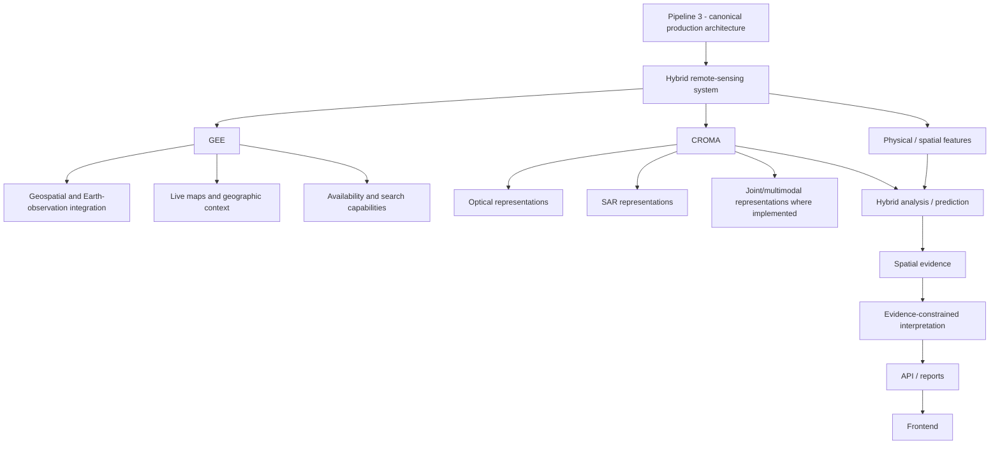
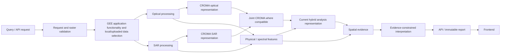
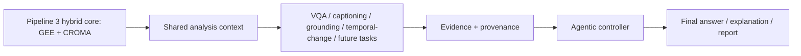

# SatQuery AI

SatQuery AI is a local, evidence-first remote-sensing research and application system for Sentinel-1/Sentinel-2 data. Its canonical production architecture is **Pipeline 3**, a hybrid remote-sensing system that combines Google Earth Engine (GEE) geospatial capabilities with CROMA learned remote-sensing representations.

The project currently supports validated optical, SAR, and joint representation workflows; physical and spectral features; controlled hybrid scientific evaluation; deterministic spatial evidence; constrained interpretation; a loopback API; and a browser frontend. It is not yet a general-purpose VQA, captioning, grounding, temporal-change, or autonomous-agent system.

## Current Project Status

**YELLOW - PARTIALLY VALIDATED.** The repository has a validated S1/S2 scientific foundation, strict raster and split controls, official CROMA execution, physical features, controlled hybrid-predictor experiments, deterministic pixel/token evidence, constrained interpretation, provenance, a loopback API, and a tested frontend. Validation is limited to the documented BigEarthNet populations and targets. The authoritative status is recorded in [Final Pipeline Audit](docs/FINAL_PIPELINE_AUDIT.md).

The supported application entry point is `python -m src.api`. HTTP analysis dispatches to `src.analysis_engine.run_analysis`. The production web runtime computes features, representations, evidence, and constrained explanations; it does not load a trained task head or emit land-cover, object, segmentation, or change predictions. Trained hybrid predictors belong to controlled scientific evaluation workflows.

## Pipeline 3 - Canonical Hybrid Remote-Sensing Architecture

Pipeline 3 is the **only canonical production architecture**. Its core is a hybrid remote-sensing system in which GEE and CROMA are complementary components of one architecture:

- **GEE** provides the geospatial and Earth-observation application side: AOI and date context, Sentinel-1/Sentinel-2 availability and search, provider authentication/status, and live-map or geographic-context functionality where implemented.
- **CROMA** provides the learned remote-sensing representation side: the currently implemented optical, SAR, and joint/multimodal representations extracted from validated 120 x 120 inputs using the official pretrained implementation.

GEE and CROMA are not separate pipelines. The physical/spectral feature layer, controlled hybrid analysis and prediction experiments, spatial evidence, constrained interpretation, API, and frontend are organized around this shared Pipeline 3 core.



The diagram does not mean that the live analysis endpoint automatically downloads GEE rasters. Current analysis processes uploaded rasters or configured local samples. GEE-backed discovery and application geospatial functions are integrated capabilities within Pipeline 3, while provider-raster acquisition for the production analysis path remains future work unless explicitly implemented and validated.

## Google Earth Engine within Pipeline 3

GEE is an integrated geospatial capability of Pipeline 3. The current implementation provides:

- Earth Engine project and authentication status checks.
- Provider-backed Sentinel-1 and Sentinel-2 availability/search for an AOI, date range, modality, resolution, and optional cloud limit.
- Source metadata and acquisition listings used by the application's availability and geographic-context experience.
- GEE-related live-map and application functionality where exposed by the frontend and API.
- A shared runtime adapter for the preserved Pipeline 3 research harness to select authenticated GEE or labelled local-reference mode.

The important runtime boundary is that `/api/availability/search` queries Earth Engine when configured, while `/api/analyze` currently assembles uploaded imagery or configured local samples. The live analysis path does not directly acquire or download GEE rasters as part of production analysis execution. Local samples are explicitly labelled local and are not represented as GEE retrieval. Historical GEE acquisition experiments remain outside the canonical live controller.

Physical feature modules retain some legacy `gee` naming because they implement the established Earth-observation feature schema; that naming does not make the feature layer a separate pipeline or imply that live GEE imagery was used.

## CROMA within Pipeline 3

CROMA is the learned representation component inside Pipeline 3. After input validation and established normalization, the official pretrained implementation extracts:

- Optical representations from canonical Sentinel-2 inputs.
- SAR representations from Sentinel-1 VV/VH inputs.
- Joint representations when optical and SAR inputs are available and compatible.
- Spatial token arrays and pooled scene vectors, with the validated shapes `[1, 225, 768]` and `[1, 768]` for each modality view.

The current hybrid representation combines physical features with pooled CROMA features. In the web runtime this is a deterministic seeded, untrained representation and is not a task prediction. In controlled scientific workflows, evaluated hybrid prediction heads are used for the documented scene-level labelled-pixel coverage experiments.

CROMA is not a change detector. It does not perform arbitrary VQA or natural-language reasoning. It supplies learned remote-sensing representations to the surrounding validated analysis and evidence system.

## Current Pipeline 3 Flow

The verified current runtime flow is:

1. The frontend sends a query, AOI/date context, a local sample, or validated GeoTIFF uploads to the loopback API.
2. The API validates the request and routes availability/search requests to the GEE-backed discovery service. Analysis input selection uses uploaded imagery or configured local samples.
3. Query planning and input validation check modality, bands, CRS, transform, extent, finite values, grid compatibility, AOI, and dates.
4. Canonical optical and/or SAR rasters are assembled and normalized for the relevant processing path.
5. Physical and spectral features are computed. When the official source/checkpoint and 120 x 120 inputs are available, CROMA extracts optical, SAR, or joint representations.
6. The current hybrid representation combines physical and CROMA features. Production web analysis exposes representation state only; controlled experiments train and evaluate hybrid prediction heads on fixed scientific splits.
7. The spatial sidecar computes deterministic pixel, local-window, edge, and 8 x 8 block evidence mapped to a 15 x 15 / 225-token grid and connected regions.
8. The constrained interpretation adapter converts allowlisted evidence claims into deterministic human-readable text with traceability. It does not use an LLM/VLM.
9. The API persists an immutable JSON report and the frontend renders the report, evidence, warnings, and explicit unavailable states.



The GEE node in this flow represents integrated application functionality and availability/search. It does not assert direct GEE raster acquisition for the live analysis path.

## Future / Target Architecture

The following is a target architecture, not current functionality. These task capabilities and the controller are planned extensions around the existing Pipeline 3 hybrid core:



VQA, captioning, grounding, temporal/change models, stronger learned fusion, typed scene/task contracts, a capability registry, and agentic routing are not implemented production capabilities today.

## Current Capabilities

- Sentinel-1 VV/VH and canonical 12-band Sentinel-2 ingestion.
- Strict identity, band, CRS, transform, extent, orientation, finite-value, AOI, date, and optical/SAR grid validation.
- GEE project/authentication status and provider-backed Sentinel-1/Sentinel-2 availability/search when configured.
- Live application geospatial context and map-related functionality where implemented by the API/frontend.
- Official CROMA optical, SAR, and joint token/scene representation extraction.
- Physical optical/SAR statistics and spectral/radar relationships.
- A deterministic physical+CROMA hybrid representation in the live runtime.
- Controlled scene-level hybrid prediction experiments with documented splits, metrics, and leakage controls.
- Pixel, local-window, edge, and 8 x 8 block aggregation as a spatial evidence sidecar.
- A `spatial_evidence_v1` model with 225 tokens, deterministic regions, traceable claims, and provenance.
- Fail-closed, template-based human-readable interpretation without an LLM/VLM.
- Persisted artifacts, hashes, manifests, predictions, metrics, reports, and provenance for documented workflows.
- Loopback HTTP API, upload validation, immutable JSON reports, and browser frontend.

## Planned / Future Capabilities

The following are future work and are not current capabilities:

- VQA and open-ended multimodal question answering.
- Captioning and learned/referring-expression grounding.
- Temporal/change representations and change prediction.
- Stronger evaluated fusion models and broader task heads.
- Confidence calibration and statistically grounded task confidence.
- Versioned `SceneBundle` / `AnalysisContext`, `TaskRequest`, and `TaskResult` contracts.
- A declarative capability registry and agentic routing/controller.
- Evidence-contract extensions for future predicted and temporal outputs.

## Pipeline History

Pipeline 1 and Pipeline 2 are archived historical/reproduction material and are not API alternatives:

- **Pipeline 1:** archived historical So2Sat-LCZ42 S1/S2 FusionCNN experiment in `experiments/github_sen12ms_training`.
- **Pipeline 2:** archived historical GEE-only and temporal experiment runners under `experiments/pipelines/gee*`.
- **Pipeline 3:** canonical current production architecture, combining the integrated GEE geospatial system with CROMA representations and the validated physical, evidence, interpretation, API, and frontend layers.

The archived runners remain available so historical results and commands stay auditable. They do not have equal architectural status with Pipeline 3 and are not imported by the production API.

## Datasets

### Selected BigEarthNet v2 5,000-area archive

`bigearthnet-v2-5000-20260911T162804Z-1-001.zip` contains 5,000 areas, 10,000 Sentinel-1 TIFFs, 5,000 reference maps, and a 5,000-row metadata table with 19 CORINE-style labels. It has no Sentinel-2 rasters and no VQA, caption, box, mask, or change annotations. It supports the leakage-controlled Pass 5 SAR evaluation after excluding all 1,000 Pass 3 areas. The archive remains outside Git.

### Matching local Sentinel-2

`D:\Satquery_ai datasets\comparison\raw-1000\BigEarthNet-S2` supplied the matching S2 imagery used by the controlled Pass 3 and Pass 5D reproduction. This 1,000-area population overlaps the selected 5,000-area archive and is not an independent new holdout.

### BigEarthNet.txt and archive limitations

The pinned BigEarthNet.txt audit matched 955 of the 1,000 selected images and 20,453 annotation records. The fragmented official archive is incomplete and is not a standalone training/evaluation source. Dataset contracts are in [`data/contracts`](data/contracts); raw data stays external.

## API and Usage

Create an environment and install dependencies:

```powershell
python -m venv .venv
.\.venv\Scripts\Activate.ps1
python -m pip install -r requirements.txt -r requirements-dev.txt
Copy-Item .env.example .env
```

Configure `.env` with external dataset, official CROMA source, and checkpoint locations. `GEE_PROJECT` and Earth Engine authentication are required for provider-backed availability/search. Do not copy datasets, checkpoints, credentials, or generated outputs into Git.

Run the automated gate:

```powershell
python -m pytest -q
node --test tests/frontend_state.test.cjs
python -m compileall -q src tests scripts
node --check src/static/app.js
git diff --check
```

Start the local application:

```powershell
python -m src.api --host 127.0.0.1 --port 8000
```

Important routes include:

- `GET /api/health` - application health.
- `GET /api/sources` - source registry and GEE status.
- `POST /api/availability/search` - validated GEE-backed imagery availability/search when configured.
- `POST /api/upload` - validated optical, SAR, or temporal-input GeoTIFF upload.
- `POST /api/analyze` - current Pipeline 3 feature/evidence analysis over local or uploaded inputs.
- `GET /api/report/{id}` - persisted JSON report.

Run sample `61_39` without the server:

```powershell
python -c "from src.analysis_engine import run_analysis; import json; print(json.dumps(run_analysis({'query':'What is present?','analysis_type':'joint_optical_sar_analysis','sample_id':'61_39','files':{}}), indent=2))"
```

The full Pass 3 and Pass 5D experiments are persisted and should not be rerun merely for a repository check. Their prerequisites and reproduction commands are documented in [Pass 3 scientific validation](docs/pass3_scientific_validation.md) and [Pass 5D reproducibility](docs/pass5d_reproducibility.md).

## Project Structure

```text
src/
  api.py                         loopback HTTP API and routes
  analysis_engine.py             current Pipeline 3 runtime orchestration
  imagery_availability.py        GEE-backed availability/search
  croma_adapter.py               official CROMA boundary
  dataset_loader.py              strict BigEarthNet ingestion
  modality_features.py           physical and spectral features
  gee_features.py                established feature schema/provider boundary
  hybrid_fusion.py               representation and scientific fusion workflows
  pixel_features.py              pixel/local/token sidecar
  evidence_schema.py             spatial_evidence_v1
  interpretation_adapter.py      constrained evidence-to-text
  static/                        frontend
tests/                           Python and frontend regression tests
docs/                            audits, architecture, validation, and design reports
experiments/                     scientific evaluation and archived runners
artifacts/                       canonical evidence and interpretation artifacts
data/contracts/                  small dataset contracts, no imagery
```

## Validation and Scientific Scope

The final checkpoint on 2026-09-13 recorded 194 Python tests passed, 7 frontend state tests passed, Python compilation passed, JavaScript syntax/static diagnostics passed, the real `61_39` sample passed, application startup and health passed, the real analysis/report round trip passed, and CROMA/physical/hybrid shapes plus pixel/token/region evidence passed. Browser automation could not start in the provided Windows computer-use runtime, so this does not claim a visual cross-browser review.

The controlled Pass 3 scene-level comparison used a fixed 600/200/200 geographic-area split. The listed hybrid result achieved the lowest MAE in that experiment, while joint CROMA achieved the best RMSE and dominant accuracy. Pass 5 added a scoped SAR generalization result. These findings apply only to the documented populations, targets, splits, and protocols; they do not validate VQA, grounding, captioning, temporal prediction, or calibrated confidence.

The current web report intentionally states that no trained task head, supervised task prediction, calibrated confidence, or change map was generated. Evidence strength is descriptive, not calibrated probability.

## Architecture and Audit Documentation

- [Pipeline consolidation](docs/PIPELINE_CONSOLIDATION.md)
- [Canonical runtime map](docs/CANONICAL_RUNTIME_MAP.md)
- [Architecture audit](docs/ARCHITECTURE_AUDIT.md)
- [Architecture freeze](docs/ARCHITECTURE_FREEZE.md)
- [Final Pipeline audit](docs/FINAL_PIPELINE_AUDIT.md)
- [Scientific gap analysis](docs/scientific_gap_analysis.md)
- [Scientific implementation plan](docs/scientific_implementation_plan.md)
- [Pass 3 leakage audit](docs/pass3_leakage_audit.md)
- [Pass 5 SAR generalization](docs/pass5_sar_generalization.md)
- [Spatial evidence audit](docs/spatial_evidence_audit.md)
- [Interpretation adapter audit](docs/interpretation_adapter_audit.md)
- [Repository cleanup report](docs/repository_cleanup_report.md)

Detailed forensic material, proposed contracts, and future architecture boundaries remain in `docs/`.

## Final Honest Summary

**CURRENTLY VALIDATED:** Pipeline 3's hybrid GEE/CROMA foundation; strict S1/S2 validation; physical features; optical, SAR, and joint CROMA representations; controlled hybrid scientific evaluation; deterministic spatial evidence; constrained interpretation; provenance; API; and frontend integration.

**NOT YET VALIDATED:** Arbitrary VQA; captioning; learned grounding; temporal/change prediction; stronger learned fusion; calibrated confidence; SceneBundle/task contracts; a capability registry; and a complete agentic controller.
