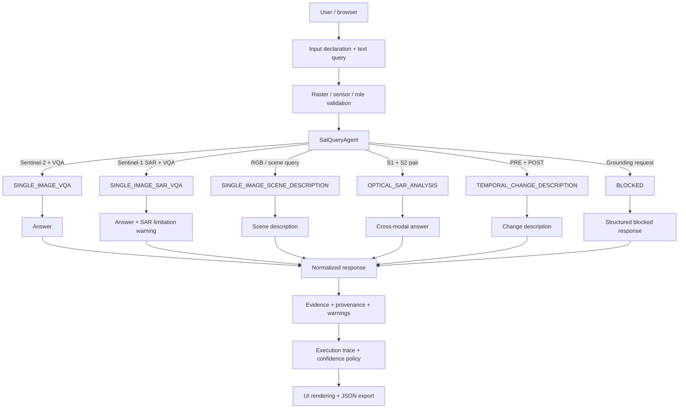
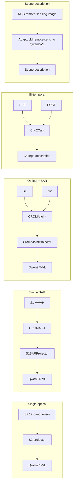
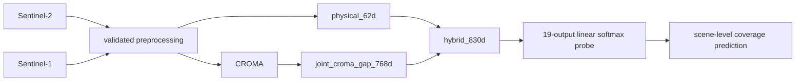
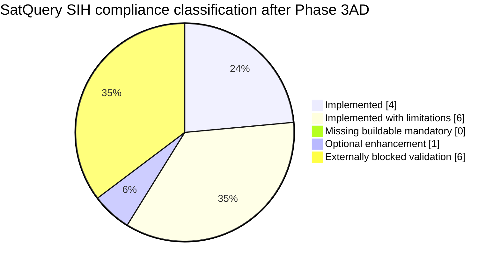

# SatQuery AI

SatQuery AI is a local, agentic vision-language system for multimodal remote-sensing analysis built for **SIH 2026 Problem Statement 26167**: **“SatQuery AI - An Interactive Vision-Language Assistant for Multimodal Remote Sensing Image Analysis through Text Queries.”**

The system accepts explicitly declared remote-sensing inputs, validates their sensor/modality/role contracts, routes the request to a bounded specialist, and returns a normalized answer with evidence, provenance, warnings, execution trace, and downloadable JSON. The project deliberately fails closed when a capability is not scientifically validated.

This README records the complete project state through **2 October 2026**, including successful work, negative results, blocked branches, runtime constraints, and final release verification. Nothing below should be read as a SOTA, benchmark-superiority, broad-generalization, calibrated-confidence, or sensor-domain-transfer claim.

---

## Final project and release status

- `PHASE3AC_COMPLETE`
- `PHASE3AD_SINGLE_SAR_COMPLETE`
- `MISSING_BUILDABLE_MANDATORY = 0`
- `SIH_CORE_IMPLEMENTED_WITH_DOCUMENTED_LIMITATIONS`
- `SATQUERY_CORE_FREEZE_RECOMMENDED`
- `SATQUERY_RELEASE_FREEZE_VERIFIED`

Frozen release:

- branch at freeze: `main`
- frozen commit: `148459d95a8499e58a95a42504d1bc0f57691fd2`
- annotated tag: `satquery-sih-core-v1.0`
- tag target: `148459d95a8499e58a95a42504d1bc0f57691fd2`
- clean release verification: Python `664 passed, 0 failed, 9 skipped`; frontend `8 passed, 0 failed`
- clean release-verification external/held-out data reads: `0`
- clean release-verification inference runs: `0`
- clean release-verification metrics computed: `0`

The tag is the frozen SIH core baseline. Later documentation-only commits do not move or replace that tag.

---

## What SatQuery implements

| Capability | Input / execution path | Current status |
| --- | --- | --- |
| `SINGLE_IMAGE_VQA` | Sentinel-2 multispectral → S2 projector → frozen Qwen | `AVAILABLE` |
| `SINGLE_IMAGE_SAR_VQA` | Sentinel-1 VV/VH `[2,120,120]` → official CROMA S1 `[1,225,768]` → Phase 3P `S1SARProjector` `[1,16,2048]` → frozen Qwen | `AVAILABLE_WITH_LIMITATIONS` |
| `SINGLE_IMAGE_SCENE_DESCRIPTION` | remote-sensing adapted Qwen2-VL specialist | `AVAILABLE` |
| `OPTICAL_SAR_ANALYSIS` | Sentinel-1 + Sentinel-2 → official CROMA joint encoder → `CromaJointProjector` → frozen Qwen | `AVAILABLE_WITH_LIMITATIONS` |
| `TEMPORAL_CHANGE_DESCRIPTION` | explicit PRE + POST → Chg2Cap → natural-language change description | `AVAILABLE` |
| `SINGLE_IMAGE_GROUNDING` | phrase/region grounding | `BLOCKED` |

Grounding is intentionally blocked rather than returning invented boxes, masks, or confidence.

---

## End-to-end architecture


```mermaid
flowchart TD
    U[User / browser] --> I[Input declaration + text query]
    I --> V[Raster / sensor / role validation]
    V --> A[SatQueryAgent]

    A -->|Sentinel-2 + VQA| S2[SINGLE_IMAGE_VQA]
    A -->|Sentinel-1 SAR + VQA| S1[SINGLE_IMAGE_SAR_VQA]
    A -->|RGB / scene query| SC[SINGLE_IMAGE_SCENE_DESCRIPTION]
    A -->|S1 + S2 pair| OS[OPTICAL_SAR_ANALYSIS]
    A -->|PRE + POST| TC[TEMPORAL_CHANGE_DESCRIPTION]
    A -->|Grounding request| GB[BLOCKED]

    S2 --> Q1[Answer]
    S1 --> Q2[Answer + SAR limitation warning]
    SC --> Q3[Scene description]
    OS --> Q4[Cross-modal answer]
    TC --> Q5[Change description]
    GB --> Q6[Structured blocked response]

    Q1 --> N[Normalized response]
    Q2 --> N
    Q3 --> N
    Q4 --> N
    Q5 --> N
    Q6 --> N

    N --> E[Evidence + provenance + warnings]
    E --> X[Execution trace + confidence policy]
    X --> J[UI rendering + JSON export]
```

### Specialist model flow


```mermaid
flowchart LR
    subgraph Optical[Single optical]
      O1[S2 12-band tensor] --> O2[S2 projector]
      O2 --> O3[Qwen2.5-VL]
    end

    subgraph SAR[Single SAR]
      S1[S1 VV/VH] --> S2[CROMA S1]
      S2 --> S3[S1SARProjector]
      S3 --> S4[Qwen2.5-VL]
    end

    subgraph Joint[Optical + SAR]
      J1[S1] --> J3[CROMA joint]
      J2[S2] --> J3
      J3 --> J4[CromaJointProjector]
      J4 --> J5[Qwen2.5-VL]
    end

    subgraph Temporal[Bi-temporal]
      T1[PRE] --> T3[Chg2Cap]
      T2[POST] --> T3
      T3 --> T4[Change description]
    end

    subgraph Scene[Scene description]
      R1[RGB remote-sensing image] --> R2[AdaptLLM remote-sensing Qwen2-VL]
      R2 --> R3[Scene description]
    end
```

---

## Agentic orchestration

`src/satquery_agent.py` is the unified routing layer. It performs:

- input classification
- query/task classification
- compatibility validation
- specialist selection
- fail-closed routing for unsupported or ambiguous requests
- specialist invocation
- response normalization
- operational execution trace
- warning/provenance propagation
- confidence-policy propagation

The unified public entry point is `POST /api/v1/query`. Legacy specialist endpoints remain for compatibility and testing.

The agent does not expose hidden chain-of-thought. The execution trace is operational: route selection, validation outcome, specialist identity, warnings, and high-level processing steps.

---

## Input contracts and generic raster foundation

SatQuery does not infer a sensor only from band count. Sensor, modality, role, and where needed band order are explicit.

### Sentinel-2

- 12-band multispectral contract
- canonical order: `B01,B02,B03,B04,B05,B06,B07,B08,B8A,B09,B11,B12`
- VQA path expects the validated project tensor contract

### Sentinel-1

- SAR role must be explicit
- canonical order: `VV,VH`
- SAR VQA contract: `[2,120,120]`
- a generic undeclared 2-band TIFF is **not** silently treated as Sentinel-1

### Temporal inputs

- explicit `PRE` and `POST` roles
- chronology is not inferred from filenames
- invalid/identical incompatible inputs fail closed

### Generic raster inspection

The bounded raster layer supports:

- GeoTIFF/TIFF inspection
- PNG/JPEG RGB where appropriate
- 3/4/8/12/17-band TIFF inspection without pretending band count proves sensor identity
- width/height/band-count validation
- finite-value checks
- nodata reporting
- corrupt-raster handling
- CRS/transform/bounds reporting
- bounded upload/read limits
- SHA-256 source digest

Cartosat-2S and RISAT declarations can be inspected and represented in provenance, but model handoff remains blocked because domain validation data is unavailable.

---

## Evidence, provenance, and uncertainty

Public responses may include:

- source filename/logical identifier
- SHA-256 input digest
- sensor/modality/role declaration
- raster dimensions and band count
- CRS
- affine transform
- resolution
- bounds
- offline footprint when valid
- bounded per-band min/max/mean/std and percentiles
- nodata and finite fractions
- pair bounds intersection/overlap
- model ID / pinned revision
- checkpoint digest
- route and specialist identity
- warnings

Important distinction:

`SPATIAL_BOUNDS_OVERLAP != COREGISTRATION_VERIFIED`

The system preserves:

`COREGISTRATION_NOT_VERIFIED`

when external coregistration has not been scientifically established.

Confidence is deliberately honest and uncalibrated:

```json
{
  "value": null,
  "type": "NOT_AVAILABLE"
}
```

SatQuery does not convert raw logits into a confidence score and call it calibrated certainty.

Public serialization strips machine-local project paths, model-cache paths, Hugging Face snapshot paths, staging directories, and local checkpoint paths while preserving logical model provenance.

---

## Models and frozen identities

| Component | Role | Frozen / verified identity |
| --- | --- | --- |
| Qwen | language generation/scoring for projector routes | `Qwen/Qwen2.5-VL-3B-Instruct`, revision `66285546d2b821cf421d4f5eb2576359d3770cd3` |
| S2 projector | Sentinel-2 → Qwen visual-token adapter | SHA-256 `e7f22d74e048cde31a746186b52b9ca5eb18b71532fc248d9a1c15fbd90819db` |
| S1 SAR projector | Sentinel-1 CROMA tokens → Qwen visual tokens | SHA-256 `a7e57bff0cba141db5c34f549d0bc3f25638960fe39ab25246bbab49e979accd` |
| CROMA joint projector | paired S1+S2 CROMA joint tokens → Qwen | SHA-256 `bedcb8dc60d3375878b6fe732cb90b568283c7d5565148fb1a52eae0d1b12eaa` |
| Chg2Cap | PRE/POST change-description specialist | SHA-256 `d737a92afa3cb76a07f672ee905afb59278211c77ccce517a37ae4637110194c` |
| scene-description specialist | remote-sensing scene description | `AdaptLLM/remote-sensing-Qwen2-VL-2B-Instruct` |

Qwen remained frozen in the projector-only studies. The learned adapters/projectors are separate from the frozen language model.

---

## Verified route receipts

### 1. Sentinel-2 single-image VQA

Phase 3U introduced the real single-image VQA route.

Internal development validation panel:

- Binary: `17/30 = 56.7%`; `28/30` parsed
- MCQ: `8/30 = 26.7%`; `26/30` parsed

These are internal validation results, **not RSVQA/VRSBench metrics**.

A later unified/browser regression retained the deterministic example answer:

`no`

### 2. Sentinel-1 single-image SAR VQA

Phase 3AD reused the existing Phase 3P S1 adapter rather than training a new one.

Verified pipeline:

```text
Sentinel-1 VV/VH [2,120,120]
  -> CROMA S1 [1,225,768]
  -> S1SARProjector [1,16,2048]
  -> frozen Qwen
  -> SINGLE_IMAGE_SAR_VQA
```

Final browser validation:

- route: `SINGLE_IMAGE_SAR_VQA`
- question: `Do parts of the image correspond to pastures?`
- validation label: `yes`
- model answer: `no`
- HTTP: `200`
- correct-vs-shuffled projected-token L2: `35.2681`
- no optical fallback
- browser console errors: `0`
- page errors: `0`
- failed requests: `0`

The wrong answer is preserved, not hidden. The route is functionally real and computationally SAR-conditioned, but the result demonstrates limited semantic performance. Therefore the warning remains:

`SAR_ONLY_SEMANTIC_VALIDATION_LIMITED`

### 3. Single-image scene description

A dedicated remote-sensing scene-description specialist was added after the older projector-caption path proved unreliable.

Verified browser output on an approved development example:

`There are some green trees on the wasteland.`

This is separate from the old S2 projector caption route.

### 4. Optical + SAR pair analysis

Verified paired path:

```text
S1 + S2
  -> official CROMA joint tokens [1,225,768]
  -> CromaJointProjector [1,16,2048]
  -> frozen Qwen
  -> OPTICAL_SAR_ANALYSIS
```

Verified browser/API example output:

`Yes`

Scientific status:

`OPTICAL_SAR_TECHNICALLY_VALID_S2_DOMINANT`

The route is technically multimodal and sensitive at intermediate/model-side levels, but controlled comparisons did **not** demonstrate an accuracy improvement over S2-only.

### 5. Bi-temporal change description

The accepted change-description alternative was implemented with LEVIR-CC/Chg2Cap.

Verified development example:

`a row of houses is built at the top of the scene`

The route is direction-sensitive and rejects identical invalid pairs. It provides natural-language change description only. It does **not** claim semantic change masks, bounding boxes, changed-area percentages, or a pixel-difference map.

---

## What did not work, or worked only partially

The project intentionally keeps negative results visible.

### Projector-only S2 adaptation had weak image dependence

Across Phase 3O/3T diagnostics:

- projector sensitivity existed at tensor/logit level
- Binary/MCQ generations were often invariant to image shuffles
- language priors remained strong
- the original caption path collapsed to empty or highly generic outputs
- additional projector-only objective variants were not promising

Final diagnosis:

`PROJECTOR_ONLY_INSUFFICIENT`

No endless projector tuning was continued after this result.

### A generation bug was real and was fixed

Phase 3O.9 found that Hugging Face generation prefill dropped placeholder `input_ids` when `inputs_embeds` was supplied, causing immediate EOS behavior. Phase 3O.10 added a wrapper that restored the IDs. Direct-forward and generation first-step logits then matched exactly (`L2 = 0.0`), and empty caption generations in the smoke panel disappeared.

This fixed a runtime/generation defect; it did not magically solve weak semantic grounding.

### Old caption route remained unreliable

The historical projector-based caption path produced `0/30` non-empty captions in the final SatQuery v1 panel. This route is not presented as a working scene-description solution. The later dedicated remote-sensing scene-description specialist is the supported path.

### Standalone SAR semantics remained weak

Phase 3P established a technically valid S1 path, but controlled diagnostics did not show strong standalone semantic behavior. Phase 3AD reused that real asset for SIH functional coverage and kept the limitation explicit rather than retraining until a desired answer appeared.

### Optical + SAR did not beat optical-only

Controlled S2-vs-joint comparisons found no demonstrated joint-model advantage. Representative Phase 3Q comparison:

- Binary: S2 `50%` vs joint `40%`
- MCQ: S2 `30%` vs joint `10%`
- generated decisions showed weak modality-identity dependence

The project therefore does not claim SAR improves accuracy over optical-only.

### Grounding remains blocked

BigEarthNet.txt contained box/point records, but the authoritative coordinate convention could not be safely mapped into the internal 120×120 analysis grid/token coordinates. All candidate grounding records remained unmapped rather than converted into guessed boxes.

`SINGLE_IMAGE_GROUNDING = BLOCKED`

### CDVQA remains externally blocked

Official CDVQA annotations were verified, but the physical SECOND-image filename mapping/chronology needed for safe acquisition and evaluation could not be authoritatively established. No change-VQA score is claimed.

### Official benchmark scores are not available

VRSBench and RSVQA were audited, but admitted development-safe evaluation data/split/evaluator conditions were not established locally. No official benchmark metrics were fabricated.

### Cartosat-2S / RISAT model validation is not available

The generic sensor layer can inspect declared Cartosat/RISAT rasters and produce safe metadata/provenance. It intentionally blocks model inference because representative authorized development data was not available to validate domain transfer.

---

## Historical scientific Pipeline 3 baseline

This result is separate from the current VLM/agent routes. It is a sealed scene-level scientific coverage experiment over a BigEarthNet v2 5,000-area multimodal set.

Dataset split:

- train: `4,600`
- validation: `200`
- held-out test: `200`

Scientific representation:

```text
physical_62d (62)
+ joint_croma_gap_768d (768)
= hybrid_830d (830)
```

Flow:


```mermaid
flowchart LR
    S2[Sentinel-2] --> P[validated preprocessing]
    S1[Sentinel-1] --> P
    P --> C[CROMA]
    P --> F[physical_62d]
    C --> G[joint_croma_gap_768d]
    F --> H[hybrid_830d]
    G --> H
    H --> L[19-output linear softmax probe]
    L --> M[scene-level coverage prediction]
```

Frozen metrics:

| Metric | Result |
| --- | ---: |
| Dominant-class accuracy | **65.0%** |
| Mean absolute error | **4.1034286734 percentage points** |
| Root mean squared error | **9.5873312123 percentage points** |

Frozen identities:

- scientific fingerprint: `ac8bbefc8918b2ee16f47653e6fd91eba0d875e4ce340e27254248712a173fae`
- dataset fingerprint: `7dfd5cd5077e7fd0307acd3fb442d4745aa829a03611c7522e08acbc7f027625`
- split fingerprint: `2232ac5bc65d3ed20c6f39deb6037bb8e0543100b247fd6c9e538eddf9feb86c`

These numbers are not VQA, caption, grounding, SAR-VQA, temporal, or current unified-agent metrics.

---

## Dataset Recovery / Re-download Guide

This guide records the verified local recovery information for the datasets and
Pipeline 3 artifacts used during development. It is operational documentation
only: it does not change the frozen release, tag, metrics, fingerprints, or
scientific claims above.

### Recovery classes

| Class | Meaning | Local items in this project |
| --- | --- | --- |
| **REDOWNLOADABLE** | Raw source data that can be recovered from its recorded source/provenance. Preserve the local provenance file so the exact selection can be checked. | `raw-1000`; `raw-5000-additional` |
| **REGENERATABLE** | Derived non-checkpoint outputs that can be recreated from the appropriate raw inputs and Pipeline 3 process. | `pipeline3-5000/scene_features/manifest.json`; revalidation JSON result/receipt files |
| **MUST BACK UP** | Local trained checkpoints. These are derived artifacts, not raw downloadable data. | `pipeline3-5000/models/`; model checkpoints under `pipeline3-5000/revalidation_6R2B/` |

Do **not** delete any local trained checkpoint until it has been backed up and
the backup has been verified.

### `raw-1000`: BigEarthNet v2 1,000-patch multimodal subset — REDOWNLOADABLE

Local layout:

- `BigEarthNet-S1/`
- `BigEarthNet-S2/`
- `Reference_Maps/`
- `metadata.parquet`
- `download-provenance.json`

Verified subset and storage facts:

- `1,000` patches split `600 / 200 / 200` (train / validation / test)
- selection seed: `17`
- country-balanced within official splits, with unique Sentinel-1 pairs
- the original demo patch was excluded
- `15,002` local files, approximately `0.26 GB`

The imagery provenance pins the BigEarthNetV2-LMDB source to revision
`118d1b6285c080ba8e4078414e1b8a243b18c9bd`:

<https://huggingface.co/datasets/hackelle/BigEarthNetV2-LMDB/resolve/118d1b6285c080ba8e4078414e1b8a243b18c9bd/BENv2.lmdb/data.mdb>

This is recorded as an **unofficial pre-conversion mirror**. The reference-map
archive is:

<https://huggingface.co/datasets/torchgeo/bigearthnet/resolve/3cf3a5910a5302d449fdb8e570e5b78de24fe07f/V2/Reference_Maps.tar.gzaa>

Verify that archive against SHA-256
`23311e4efee2622052a7102a164473a5150f1e3bc47625c4a897b1c21063efd1`.
Retain `download-provenance.json`: it contains the exact selected patch
identities in addition to the source metadata.

### `raw-5000-additional`: additional Sentinel-2 acquisition — REDOWNLOADABLE

This local source set contains:

- `BigEarthNet-S2/`
- `pipeline3-5000-s2-acquisition.json`
- `52,001` files, approximately `0.64 GB`

Its acquisition record verifies `requested_count: 4000`, `4,000` `area_ids`,
`complete_for_requested_rows: true`, and source revision
`118d1b6285c080ba8e4078414e1b8a243b18c9bd`. Keep
`pipeline3-5000-s2-acquisition.json` with any recovery copy; it records the
requested area identities and completion status.

Together, `raw-1000` and this additional Sentinel-2 acquisition support the
5,000-area Pipeline 3 source set. This record does **not** establish
Sentinel-1 or reference-map coverage for the added 4,000 areas; do not infer
that coverage from this directory.

### `pipeline3-5000`: derived Pipeline 3 outputs — REGENERATABLE / MUST BACK UP

`pipeline3-5000/` is a local derived-output directory, not downloadable raw
data. Its verified contents are:

- `models/`: six small local checkpoint files (**MUST BACK UP**)
- `scene_features/manifest.json`: approximately `36.23 KB`
  (**REGENERATABLE**)
- `revalidation_6R2B/`: five JSON result/receipt files
  (**REGENERATABLE**) and five model checkpoints (**MUST BACK UP**)

The revalidation test receipt records `consumed_once` over `200` test areas.
Retain receipts when preserving an experiment record, but never treat them or
the local model files as redownloadable raw data.

---

## Dataset and annotation foundation

The BigEarthNet.txt foundation was built conservatively and source-preserving.

Recorded annotation audit:

| Measure | Count |
| --- | ---: |
| Source rows scanned | `9,553,962` |
| Selected canonical records | `101,571` |
| Validated samples | `101,542` |
| Quarantined records | `29` |
| Duplicate annotation IDs / exact duplicates / conflicting source IDs | `0 / 0 / 0` |
| Cross-split image leakage / test rows assigned to train | `0 / 0` |
| Identical QA-content overlaps across image splits | `2,001` |

The `2,001` figure is content overlap, not image-identity leakage.

The Phase 2E image-language view contains `101,542` validated samples on `4,770` unique images:

- train: `93,208`
- validation: `4,175`
- test: `4,159`

Those are assembled typed records; they do not imply that every task was evaluated.

---

## Development history

| Phase / branch | What was done | Final result |
| --- | --- | --- |
| Phase 1 | deep architecture/runtime audit | canonical scientific/runtime boundaries documented |
| 2A | BigEarthNet.txt annotation foundation | validated + quarantined source-preserving records |
| 2B | spatial contracts + leakage policy | explicit coordinate spaces and image-group split rules |
| 2C | representation linking | deterministic links to image/split/provenance |
| 2D.1 | representation catalog + region contract | typed artifact admission |
| 2D.2 | 5,000-area representation core | physical/CROMA/hybrid core materialized and verified |
| 2E | image-language foundation | typed VQA/caption/grounding task records and adapter contracts |
| 2F | BigEarthNet spatial-semantics audit | coordinate semantics unresolved; grounding fail-closed |
| 2G | engineering integration | bounded export/acquisition/reproducibility patterns |
| 2H | representation/compute/storage policy | persistence, cache, compute boundaries documented |
| 3O | S2 projector + Qwen adaptation/diagnostics | technically functional; weak image dependence; generation bug fixed |
| 3P | Sentinel-1 SAR projector research | technically functional; limited semantics |
| 3Q | S1+S2 CROMA joint projector | technically valid; S2-dominant, no demonstrated gain |
| 3R/3S/3T | multimodal integration + diagnosis | SatQuery v1 integrated; projector-only limitation established |
| 3U | single-image VQA + grounding audit | VQA working; grounding blocked |
| 3V | temporal/CDVQA/LEVIR investigation | CDVQA blocked; LEVIR-CC/Chg2Cap change-description route working |
| 3W | unified SatQueryAgent | agentic routing/API/frontend integration |
| 3X | final SIH readiness + scene specialist | working dedicated scene-description route; demo-ready with limitations |
| 3Z | generic inputs + sensor adapters | bounded generic raster support; strict explicit sensor contracts |
| 3Z.2 | Cartosat/RISAT admission | model inference blocked for lack of authorized validation data |
| 3AA | VRSBench/RSVQA admission | external benchmark evaluation blocked |
| 3AB | geospatial evidence | metadata/statistics/footprint/pair-overlap evidence integrated |
| 3AC | runtime/deployment hardening | preflight, lifecycle, memory stability, sanitization, safe staging |
| 3AD | single-SAR compliance closure | real SAR-only route completed with documented semantic limits |
| release freeze | full clean verification | `SATQUERY_RELEASE_FREEZE_VERIFIED` |

---

## Compliance state after Phase 3AD

Affected SIH re-audit counts:


```mermaid
pie showData
    title SatQuery SIH compliance classification after Phase 3AD
    "Implemented" : 4
    "Implemented with limitations" : 6
    "Missing buildable mandatory" : 0
    "Optional enhancement" : 1
    "Externally blocked validation" : 6
```

The important result is `MISSING_BUILDABLE_MANDATORY = 0`.

The only optional feature explicitly retained in that final affected audit was richer change-mask/area output. Grounding is also a possible future enhancement, but the implemented scene-description alternative satisfies the supported single-image branch used for SIH compliance.

---

## Runtime, GPU lifecycle, and deployment hardening

Verified runtime family:

- Python `3.13.14`
- PyTorch `2.11.0+cu128`
- CUDA available
- target GPU: RTX 5060 class, approximately 8 GB VRAM

The route family is too large to safely keep every heavy specialist resident simultaneously. Runtime policy is therefore:

`ONE ACTIVE HEAVY SPECIALIST FAMILY AT A TIME`

The runtime includes:

- lazy controller/model construction
- same-route reuse/caching
- explicit route-family eviction
- garbage collection + CUDA cache cleanup during switches
- serialized protected GPU access
- preflight checks before service start
- `/api/v1/health`
- `/api/v1/ready`
- bounded upload bodies
- connection/request timeout handling
- structured OOM error boundary
- rotating logs
- graceful shutdown
- temp-request staging and TTL cleanup
- safe startup stale-staging recovery
- traversal and symlink/reparse containment
- public-path sanitization

Peak receipts:

| Verification | Max allocated | Max reserved |
| --- | ---: | ---: |
| Phase 3AC mixed lifecycle | `8,347,854,848` bytes | `8,489,271,296` bytes |
| Final Phase 3AD SAR run | `8,387,342,336` bytes | `8,493,465,600` bytes |

GPU headroom is tight. The system is verified under the one-heavy-family lifecycle, not under simultaneous residency of every specialist.

---

## Runtime defects found and fixed

The project also records implementation defects rather than hiding them:

- Hugging Face generation prefill dropped placeholder IDs when `inputs_embeds` was provided; fixed by restoring the IDs in the generation wrapper.
- Optical-SAR controller construction originally reloaded heavy assets every request; fixed with route-family runtime caching/lifecycle management.
- public optical-SAR provenance exposed a local Hugging Face snapshot path through `qwen_revision`; fixed by separating internal load location from public logical model ID/revision.
- upload staging cleanup needed root-level reparse/symlink validation; fixed so the configured root is checked before unsafe resolution.
- SAR verification exposed CUDA fingerprint ordering, validation-runner import-path, and inference-mode tensor-reuse issues; each was fixed before final verification.
- some legacy tests encoded obsolete route/status expectations; these were updated during release-freeze verification after confirming current intended behavior.

---

## Final regression and clean-release verification

Frozen release verification completed with no external dataset access from process start.

Final clean receipt:

- Python: `664 passed, 0 failed, 9 skipped`
- frontend: `8 passed, 0 failed`
- tracked repository modified during clean verification: `No`
- `.env` modified: `No`
- real BigEarthNet root enumerated: `No`
- external metadata read: `No`
- held-out image identifiers enumerated: `0`
- external image tensors loaded: `0`
- external labels read: `0`
- VRSBench reads: `0`
- RSVQA reads: `0`
- CDVQA reads: `0`
- Cartosat-2S reads: `0`
- RISAT reads: `0`
- external inference runs: `0`
- external metrics computed: `0`
- `git diff --check`: pass
- cached diff check: pass

A previous verification attempt had enumerated an externally configured dataset and read its metadata label column before the safe-environment rerun. That fact is not hidden. It performed no held-out tensor inference or metrics. The clean release receipt was then rerun from process start with all external data paths disabled and achieved the zero-access figures above.

---

## Scientific claim boundaries

SatQuery explicitly does **not** claim:

- SOTA performance
- benchmark superiority
- broad generalization to arbitrary remote-sensing sensors/domains
- that SAR improves accuracy over optical-only
- strong standalone SAR semantics
- official RSVQA/VRSBench/CDVQA scores
- validated Cartosat-2S/RISAT model transfer
- calibrated confidence
- semantic grounding
- semantic change masks
- changed-area estimates
- verified external coregistration
- that metadata/statistical/geospatial evidence is equivalent to semantic explanation

Current honest summaries:

- S2 VQA: functional, internal validation only
- single-SAR VQA: functional and SAR-conditioned, semantic validation limited
- S1+S2: technically valid, S2-dominant, no demonstrated accuracy gain
- scene description: dedicated specialist works
- temporal: natural-language change description works
- grounding: blocked
- confidence: `NOT_AVAILABLE`

---

## Externally blocked validation

The following remain outside the frozen core because required data/admission/authorization was not available:

- VRSBench evaluation
- RSVQA evaluation
- CDVQA evaluation / physical image linkage
- Cartosat-2S model-domain validation
- RISAT model-domain validation
- final ISRO/SAC evaluation data

These should be evaluated against the frozen system when legitimate data becomes available; they should not trigger fabricated local benchmark claims.

---

## Repository layout

```text
src/          application, unified agent, specialists, API, evidence, runtime, browser UI
tests/        routing, specialist, API, raster, runtime, staging, serialization, frontend tests
docs/         architecture, phase reports, SIH compliance, limitations, setup, audit records
scripts/      reproducible development/verification scripts
artifacts/    local receipts and generated evidence; large/local artifacts are not source of truth in Git
data/         contracts and compact project data; raw external imagery remains machine-local
```

Key modules include:

- `src/satquery_agent.py` — unified agent routing
- `src/single_image_vqa.py` — Sentinel-2 VQA
- `src/single_image_sar_vqa.py` — Sentinel-1 SAR VQA
- `src/scene_description.py` — scene-description specialist
- `src/satquery_v1.py` — paired optical/SAR controller
- `src/temporal_change.py` — PRE/POST change description
- `src/generic_raster.py` — bounded raster inspection
- `src/sensor_adapters.py` — sensor/modality/role contracts
- `src/geospatial_evidence.py` — evidence/statistics/footprints
- `src/specialist_runtime.py` — heavy-specialist lifecycle
- `src/public_serialization.py` — public-path/provenance sanitization
- `src/upload_staging.py` — safe request staging/recovery
- `src/api.py` — HTTP API and unified query endpoint
- `src/static/` — browser UI

---

## Local installation and run

SatQuery is a local Windows-oriented research runtime. It does not automatically download imagery or model weights.

1. Install the pinned runtime/development dependencies.
2. Copy `.env.example` to `.env`.
3. Configure machine-local dataset/checkpoint/model paths in `.env`; never commit `.env`.
4. Provide separately acquired approved data/checkpoints required for the route being exercised.
5. Start the service:

```powershell
python -m src.api --host 127.0.0.1 --port 8000
```

Or use the hardened startup script documented in the repository.

Open:

`http://127.0.0.1:8000`

Useful verification commands:

```powershell
python -m pytest -q
node --test tests/frontend_state.test.cjs
```

For frozen-release verification, external dataset paths must be disabled before Python/test collection begins if zero external-data access is being certified.

---

## Documentation index

Primary current documents:

- [Final architecture](docs/SATQUERY_FINAL_ARCHITECTURE.md)
- [SIH 26167 compliance matrix](docs/SIH_26167_COMPLIANCE_MATRIX.md)
- [Scientific limitations](docs/SATQUERY_SCIENTIFIC_LIMITATIONS.md)
- [Setup and run](docs/SATQUERY_SETUP_AND_RUN.md)
- [Phase 3U single-image VQA / grounding](docs/PHASE3U_SINGLE_IMAGE_VQA_AND_GROUNDING.md)
- [Phase 3V temporal work](docs/PHASE3V_BITEMPORAL_CHANGE_AND_VQA.md)
- [Phase 3W full agentic integration](docs/PHASE3W_FULL_AGENTIC_SATQUERY.md)
- [Phase 3X final SIH readiness](docs/PHASE3X_FINAL_SIH_READINESS.md)
- [Phase 3Z generic inputs / sensor adapters](docs/PHASE3Z_GENERIC_INPUT_AND_SENSOR_ADAPTERS.md)
- [Phase 3AB geospatial evidence](docs/PHASE3AB_GEOSPATIAL_EVIDENCE.md)
- [Phase 3AC runtime hardening](docs/PHASE3AC_RUNTIME_DEPLOYMENT_HARDENING.md)
- [Phase 3AC.4 sanitization / staging recovery](docs/PHASE3AC4_SANITIZATION_AND_STAGING_RECOVERY.md)

The repository also preserves earlier foundation, diagnostic, benchmark-admission, temporal-admission, runtime-memory, and browser-verification reports for auditability.

---

## Freeze policy

The frozen tagged core is complete for the currently implemented SIH functional scope. Future work should be triggered by new authorized evaluation data or explicit new requirements, not by automatically extending the phase chain.

Do not silently change the frozen release claims. If future benchmark/sensor evaluation becomes possible, report it as new evidence against the frozen baseline or as a clearly versioned later release.
