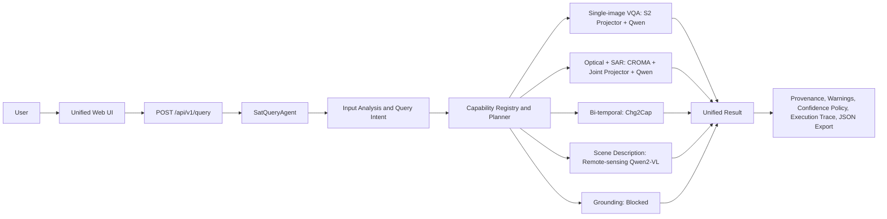

# SatQuery AI: SIH final presentation content

Audience: SIH judges. Target length: 10–12 slides and a 2–4 minute live demonstration. Keep the spoken explanation focused on verified behavior and visible limitations.

## Slide 1 — SatQuery AI

**Agentic remote-sensing assistant for image, sensor-pair, and temporal questions**

- SIH PS-26167 submission
- Local, provenance-first browser application
- Four verified demonstration workflows

Presenter line: “SatQuery selects a remote-sensing specialist from the user's input configuration and question.”

## Slide 2 — Challenge

Remote-sensing analysis uses different kinds of evidence: one optical scene, paired SAR and optical imagery, and images acquired at different dates. A generic route can confuse those data contracts and hide how an answer was produced.

- Users need a clear answer path for each input type.
- Judges need visible provenance, limits, and failure behavior.
- Unsupported requests must fail safely instead of returning invented evidence.

## Slide 3 — Why a specialist system

SatQuery uses an agentic controller instead of one model for every request.

- It classifies the input configuration and question intent.
- It selects a specialist only when their contracts match.
- It returns a shared result format with warnings and a public execution trace.

## Slide 4 — SatQuery solution

**One web interface, four verified analysis routes**

- Single-image VQA for an approved Sentinel-2 image
- Joint optical and SAR analysis for a matched Sentinel-1 and Sentinel-2 pair
- PRE/POST natural-language change description
- Single-image remote-sensing scene description

Grounding remains blocked because the release has no validated spatial-grounding specialist.

## Slide 5 — Agentic architecture



Presenter line: “The agent chooses the branch. It does not mix a temporal pair with an optical-SAR pair or silently fall back when a route is unavailable.”

## Slide 6 — Specialists and input contracts

| Route | Required input | Specialist | Guardrail |
| --- | --- | --- | --- |
| `SINGLE_IMAGE_VQA` | One approved S2 image | S2 projector + frozen Qwen2.5-VL | Internal validation only |
| `OPTICAL_SAR_ANALYSIS` | Matched S1 + S2 pair | CROMA joint + projector + frozen Qwen2.5-VL | No demonstrated gain over S2-only |
| `TEMPORAL_CHANGE_DESCRIPTION` | T1/PRE + T2/POST | Chg2Cap | Text only, no change mask or area |
| `SINGLE_IMAGE_SCENE_DESCRIPTION` | RGB rendering or RGB upload | AdaptLLM remote-sensing Qwen2-VL-2B | No benchmark receipt |

## Slide 7 — Single-image workflows

- **VQA demo:** approved S2 TRAIN patch, question “Is water visible in this image?”, route `SINGLE_IMAGE_VQA`, observed answer `no`.
- **Scene demo:** same approved non-test image as an explicit RGB rendering, question “Describe this image.”, route `SINGLE_IMAGE_SCENE_DESCRIPTION`, observed output “There are two green trees in the picture.”
- Both outputs are functional demonstrations, not benchmark correctness claims.

## Slide 8 — Optical + SAR analysis

Input: approved non-test matched Sentinel-1 and Sentinel-2 pair.

```text
S1 + S2 -> CROMA joint representation -> joint projector -> frozen Qwen -> normalized response
```

- Real browser flow passed with `OPTICAL_SAR_ANALYSIS`.
- Observed answer: `Yes`.
- Important limit: the controlled internal comparison did not demonstrate an improvement over the optical-only baseline.

## Slide 9 — Bi-temporal change understanding

Input: LEVIR-CC validation `val_000001.png`.

- T1 = folder A = PRE
- T2 = folder B = POST
- Route: `TEMPORAL_CHANGE_DESCRIPTION`
- Specialist: Chg2Cap
- Observed output: “a row of houses is built at the top of the scene”

The route generates a natural-language change description. It does not claim a change mask, bounding box, or area estimate.

## Slide 10 — Live demo and accountable output

Show the UI in this order: VQA, optical + SAR, bi-temporal, scene description, then optional blocked grounding.

For each successful route, show:

- selected route and specialist
- generated result
- provenance and warning text
- public execution trace
- JSON export

For grounding, show the structured `BLOCKED` result. No box, mask, confidence, or fallback answer appears.

## Slide 11 — Verified engineering results

| Evidence | Verified result |
| --- | --- |
| Single-image binary VQA | 17/30, 56.7% internal validation |
| Single-image MCQ | 8/30, 26.7% internal validation |
| Temporal smoke panel | 5/5 nonempty captions on approved development pairs |
| Agent routing | 4/4 primary demo routes correct |
| Browser primary flows | 0 console errors, 0 page errors, 0 failed requests |
| Focused tests | 37 Python passed, 7 frontend passed |

Do not combine these measures into an overall accuracy.

## Slide 12 — Limitations and next steps

- VQA numbers are internal validation only.
- Optical-SAR fusion did not outperform the S2-only control.
- Temporal output is text only.
- Scene description has no benchmark evaluation receipt.
- Grounding is unavailable.
- Cartosat-2S and RISAT transfer remain unvalidated.

Future work: authorized VRSBench and RSVQA evaluation, a validated grounding specialist, spatial change masks, calibrated uncertainty, and validated sensor adapters.
